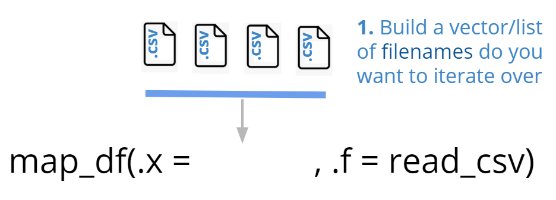
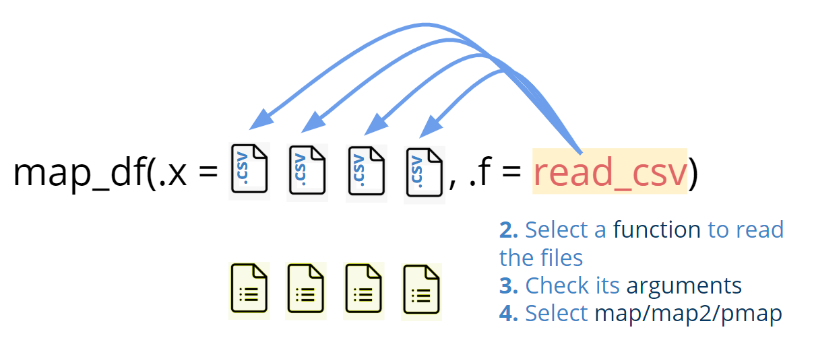
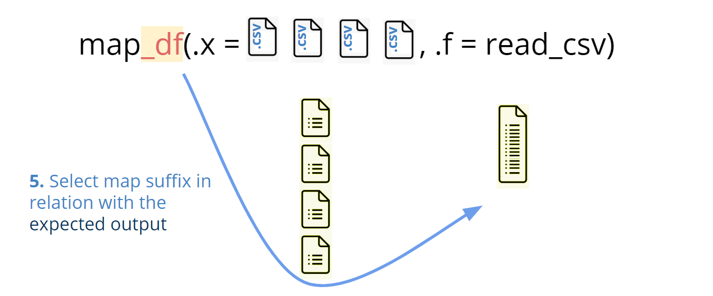
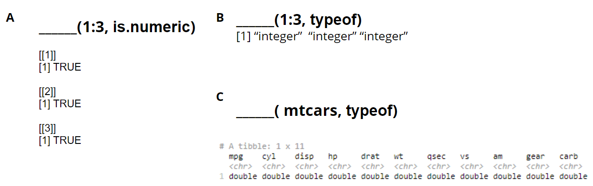
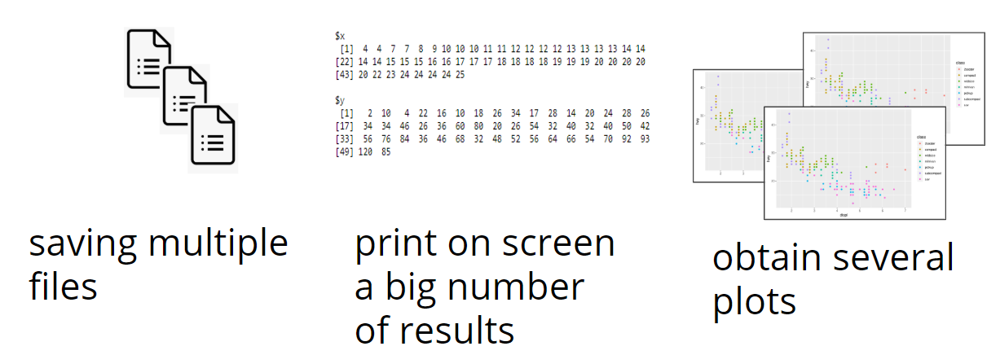
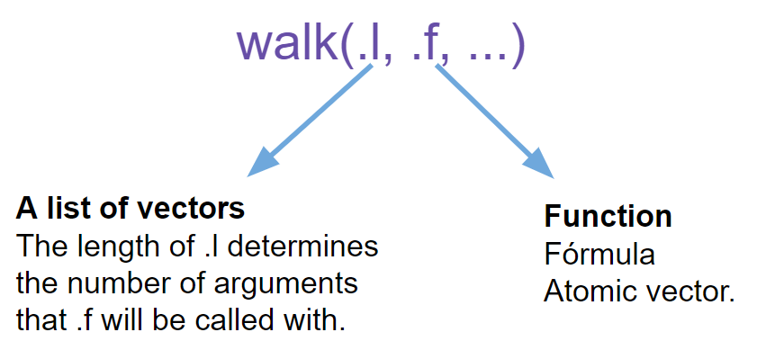
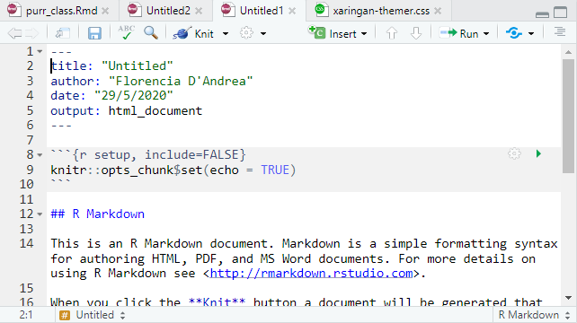
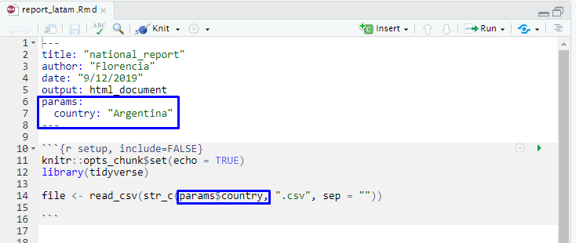
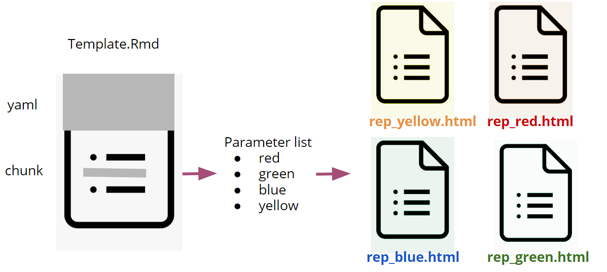
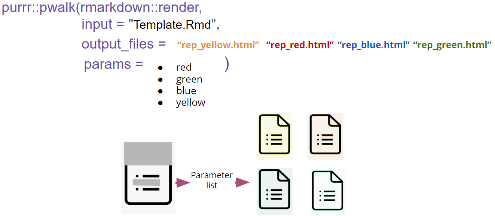

```{r xaringan-themer, include=FALSE, warning=FALSE}
library(xaringanthemer)
style_mono_accent(
  base_color = "#1037A0",
  inverse_background_color = "#16a67a",
  header_font_google = google_font("Josefin Sans"),
  text_font_google   = google_font("Montserrat", "300", "300i"),
  code_font_google   = google_font("Fira Mono")
)

```

```{r setup, include=FALSE}
options(htmltools.dir.version = FALSE,
        fig.align='center')
library("showtext")
```

class: center, middle

# Iteration with purrr package

### for automatized files management

---
class: inverse, center, middle

### 1. Obtain a dataframe from multiple files
 
### 2. Automatize report generation


---
class: inverse, center, middle

### <span style="color: #f2cc9d;">1. Obtain a dataframe from multiple files</span> 
 
### 2. Automatize report generation

---

### Read files using `map_df()`

```{r one, echo = FALSE, out.extra=400}

```

---

### Read files using `map_df()`

```{r two, echo = FALSE}

```

---

### Read files using `map_df()`

```{r three, echo = FALSE}

```
---
# Let’s practise
### Which function would you use to obtain these return values?

1. `map()`
2. `map_df()`
3. `map_chr()`


```{r four, echo = FALSE}

```


---
class: inverse, center, middle

# Live coding #1

#### 1. Build a vector of *filenames* do you want to iterate over
#### 2. Select a *function* to read the files 
#### 3. Check the number of *arguments* the function need
#### 4. Select among `map()`/`map2()`/`pmap()`
#### 5. Select `map_*()` suffix in relation of the *desired output*

File xxx in [](https://mybinder.org/v2/gh/flor14/purrr_class.git/master)

---

class: inverse, center, middle

### 1. Obtain a dataframe from multiple files
 
### 2. Automatize report generation 
---

class: inverse, center, middle

### 1. Obtain a dataframe from multiple files
 
### <span style="color: #f2cc9d;">2. Automatize report generation</span> 
---

### Iterate using a function for its side effects

```{r five, echo = FALSE}

```

---
### `purrr::walk()` family of functions

```{r six, echo = FALSE, fig.height=4}

```

---

# Let´s practise
### Which of these functions you would use with walk() family of functions?
1. `purrr::safely()`
2. `~ggplot(., aes(mpg, wt)) + geom_point()`
3. `rmarkdown::render()`
4. `~list(name = .)`

Can you explain your choice on using `map()` or `walk()` to iterate with these functions?
---

### RMarkdown

```{r rmark, echo = FALSE}

```

---

### RMarkdown Template file

Add parameters 

```{r eight, echo = FALSE}


```

---

### Automatization of report generation

```{r seven, echo = FALSE}

```

---

### `pwalk()` function

```{r final, echo = FALSE}

```

---

class: inverse, center, middle

# Live coding #2

File xxx in [](https://mybinder.org/v2/gh/flor14/purrr_class.git/master)

---
class: center, middle

# Thanks!

Slides created via the R package [**xaringan**](https://github.com/yihui/xaringan).

The chakra comes from [remark.js](https://remarkjs.com), [**knitr**](http://yihui.org/knitr), and [R Markdown](https://rmarkdown.rstudio.com).
